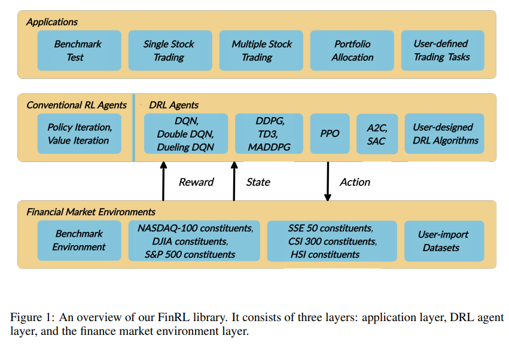

# [FinRL: A Deep Reinforcement Learning Library for Automated Stock Trading in Quantitative Finance](https://paperswithcode.com/paper/finrl-a-deep-reinforcement-learning-library)

## 서론

> Stock Trading에 있어서 DRL (Deep Reinforcement Learning)은 많은 이점을 보여왔으며 아래와 같은 2가지 장점 존재

- Portfolio 확장성
- Market Model 독립성

> DRL 및 RL이 Financial Sector에서 효과적이었으나 구현하고 관리하기 까다로움. 따라서 저자들은 초심자도 다룰 수 있는 library와 학습된 DRL algorithm을 이용하여 이러한 문제를 해소했다. 그리고 이 Library 및 관련 도구들은 아래 원칙을 준수한다.

- Completeness
  > DRL에 필요한 모든 도구를 갖춤
- Hands-on Tutorial
  > 상세한 따라하기를 포함하는 Tutorial을 제공
- Reporducibility
  > 재현 가능하며 투명한 결과물을 제공

## Architecture

> 이 논문에서 3 계층으로 구성된 FinRL을 소개


- Layer 1. Financial Market Simulation Environment
- Layer 2. Agent providing DRL algorithm
- Layer 3. Applications for stock trading

## State, Action space and Reward function

- State Space
  > Represent Enviroment (Observed Description of Market) 시장에 대한 대표적인 특징 (Features)
  - Balance (잔고)
  - Shares Own (보유 주식)
  - Closing Price (종가)
  - Opening/High/Low Prices
  - Trading Volume (거래량)
  - 기술적 지표 (```MACD```, ```RSI```)
  - Multi-level granularity (분,시,일 단위 데이터 지원)

- Action space
  - ```{-k,..,0,..k}``` k는 양의 정수로 사거나 팔아야 할 주식의 수
  - 0이면 hold
- Reward function
  - Portfolio의 가치 변동 : ```v_hat - v```
  - Value Return : ```Log (v_hat / v)```
  - Sharpe Ratio : ```mean(Rt) / stdev(Rt) where Rt = v_hat - v```

## Datasets

> 6가지 마켓 데이터 제공에 추가로 하나의 사용자 정의 환경을 제공

- NASDAQ-100
- DJIA
- S&P 500
- SSE 50
- CSI 300
- HSI
- User-defined data (KOSPI 등등...)

## DRL Agents

> 7개의 알고리즘을 제공하며 이들 DRL 알고리즘을 훈련 시켜 사용자는 그들만의 알고리즘을 설계할 수 있다.

## Evaluating

> 표준화된 지표와 baselines 트레이딩 전략들이 제공되어 성능 비교 분석이 가능하다.

### Standard Metrics

- Final Portfolio Value
- Annualized Return
- Annualized Stdev
- Max Drawdown ratio
- Sharpe Ratio

---

## Walkthrough Tutorials

### Tutorial 1 . Installation

- Jupyter notebook for FinRL